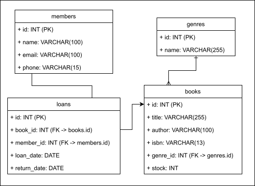

# Tugas Praktikum DPBO #7

Dibuat untuk menyelesaikan TP7 Desain Pemrograman Berorientasi Objek (DPBO)

## Janji

Saya Willsoon Tulus Parluhutan Simanjuntak dengan NIM 2404756 mengerjakan evaluasi Tugas Praktikum 7 dalam mata kuliah Desain Pemrograman Berorientasi Objek untuk keberkahanNya maka saya tidak melakukan kecurangan seperti yang telah dispesifikasikan. 

Aamiin.

## Desain program

### Diagram UML:

### Deskripsi desain basis data:

- Suatu member bisa memiliki lebih dari 1 pinjaman buku, yang merupakan suatu sesi pinjaman.
- Suatu sesi pinjaman hanya dapat terhubung ke satu buku dan satu member.
- Suatu genre bisa digunakan oleh lebih dari 1 buku.
- Suatu buku hanya bisa memiliki 1 genre saja.

## Alur jalan program

Program ini menyediakan antarmuka berupa webpage yang bisa dibuka oleh user (misal: admin perpustakaan) untuk mengelola stok buku perpustakaan, member perpustakaan, dan peminjaman buku.

## Preview operasional program

https://github.com/user-attachments/assets/db39e633-f164-4cd2-b78b-b24795862e20

